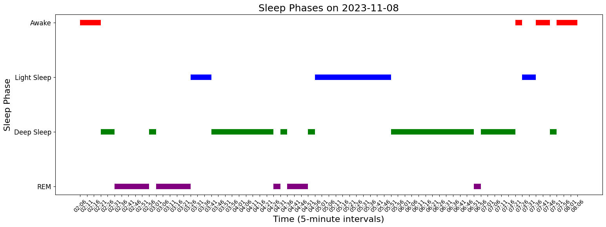
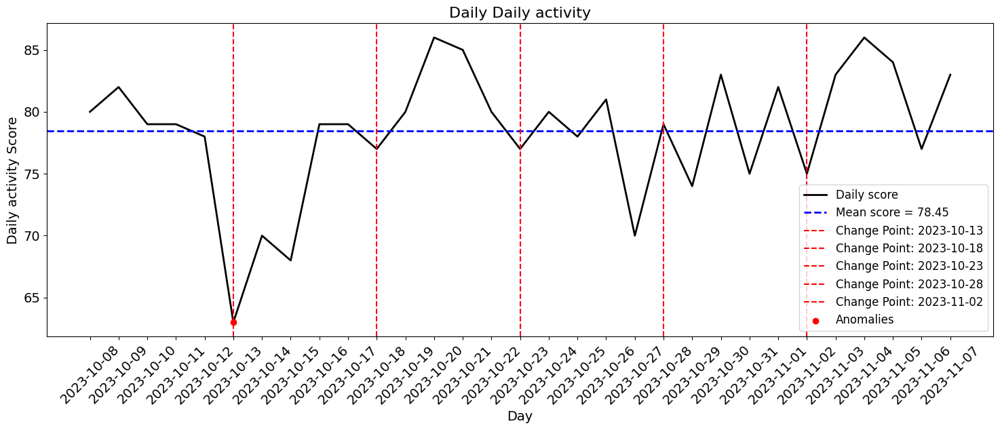

# OuraDataHandler

**OuraDataHandler** is a Python library designed for managing, analyzing, and visualizing Oura Ring data. It enables fetching data from the Oura API, loading from CSV files, and generating insightful plots, making it an essential tool for researchers and developers working with health and sleep metrics.

---

## Features
- **API Integration**: Fetch metrics like sleep, activity, and readiness directly from the Oura API.
- **CSV Support**: Load and analyze data from local CSV files.
- **Data Visualization**: Plot trends, anomalies, and patterns for various metrics.
- **Custom Analysis**: Detect trends and highlight anomalies with adjustable parameters.

---

## Directory Structure

Below is the project’s directory tree along with a description of each file:

```
OuraDataHandler/
├── src/
│   ├── __init__.py                # Package initializer for the OuraDataHandler library
│   ├── oura_data_handler.py       # Main implementation of the OuraDataHandler class
├── examples/
│   ├── example_usage.ipynb        # Jupyter Notebook demonstrating library usage
│   ├── daily_activity_plot.py     # Example script for plotting daily activity data
│   ├── sleep_data_visualisation.py# Example script for visualizing sleep data
├── tests/
│   ├── __init__.py                # Package initializer for tests
│   ├── test_oura_data_handler.py  # Unit tests for OuraDataHandler functionality
├── data/
│   ├── your_csv_files_here.csv    # Placeholder for user-provided CSV data files
├── docs/
│   ├── images/                    # Folder for example images used in documentation
│   ├── sleep_trends.png           # Example plot showing sleep trends
│   ├── activity_plot.png          # Example plot showing activity metrics
├── requirements.txt               # List of Python dependencies
├── setup.py                       # Script to package and install the library
├── CONTRIBUTING.md                # Guide for contributing to the project
├── LICENSE                        # License information (MIT)
├── README.md                      # Project overview and documentation
```

---

## Installation

### Prerequisites
- Python 3.7 or higher
- pip package manager

### Steps
1. Clone the repository:
   ```bash
   git clone https://github.com/CMC-lab/OuraDataHandler.git
   cd OuraDataHandler
   ```

2. Install dependencies:
   ```bash
   pip install -r requirements.txt
   ```

---

## Usage

### 1. Set Up Data Files and Token
Prepare your data file paths and API token:
```python
data_files = {
    'daily_sleep': '/path/to/your/daily_sleep.csv',
    'daily_activity': '/path/to/your/daily_activity.csv',
    # Add more data files here...
}
access_token = "YOUR_API_ACCESS_TOKEN"
```

### 2. Use in a Script
Here’s an example script to visualize sleep data:
```python
from src.oura_data_handler import OuraDataHandler

# Initialize the handler
oura_data = OuraDataHandler(
    api_address="https://api.ouraring.com",
    local_data_paths=data_files,
    access_token=access_token
)

# Fetch and plot data
sleep_data = oura_data.fetch_data_from_api(data_type="daily_sleep", start_date="2023-11-01", duration="month")
oura_data.plot_data(sleep_data, column='score', title='Daily Sleep Score Over Time')
```

Save this script as `example.py` and run it:
```bash
python example.py
```

---

### 3. Use in a Notebook
You can also run the library in a Jupyter notebook:

1. Open a notebook in VS Code:
   ```bash
   code examples/example_usage.ipynb
   ```

2. Add the `src` directory to the Python path in the first cell:
   ```python
   import sys
   sys.path.append('/path/to/OuraDataHandler/src')
   ```

3. Use the library interactively:
   ```python
   from oura_data_handler import OuraDataHandler
   # Initialize and use the handler as shown above
   ```

Run the cells to see the results.

---

## Example Visualizations

### Sleep Trends
Analyze daily sleep and visualize phases:


### Activity Metrics
Track daily activity metrics over time:


---

## Testing

Run tests to validate the functionality:
```bash
pytest tests/
```

---

## Contributing

We welcome contributions! Check out the [CONTRIBUTING.md](CONTRIBUTING.md) file for guidelines on how to contribute.

---

## License

This project is licensed under the MIT License. See the [LICENSE](LICENSE) file for details.

---

## Acknowledgements

- [Oura Ring API Documentation](https://cloud.ouraring.com/v2/docs)
- Python libraries: `numpy`, `pandas`, `matplotlib`, `requests`, `ruptures`